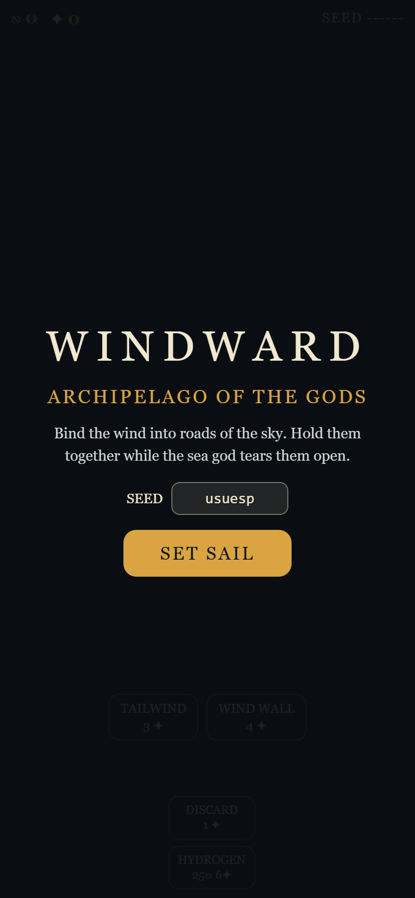
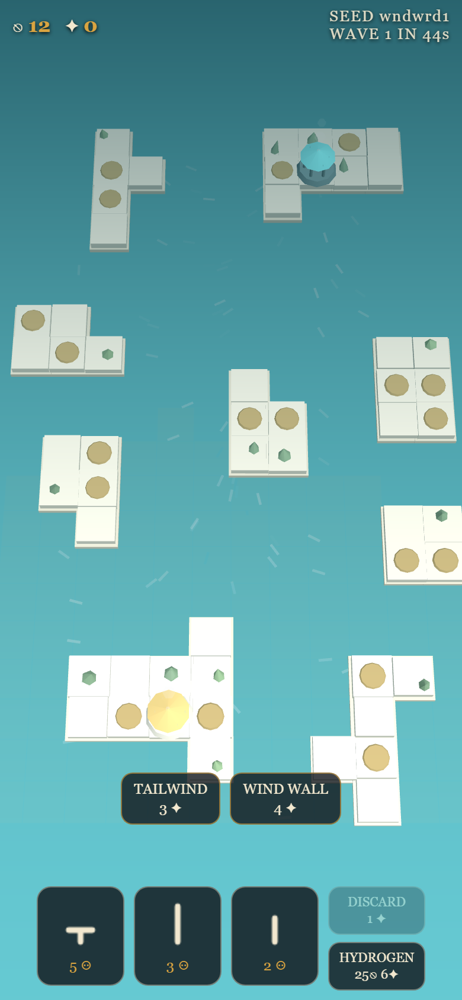
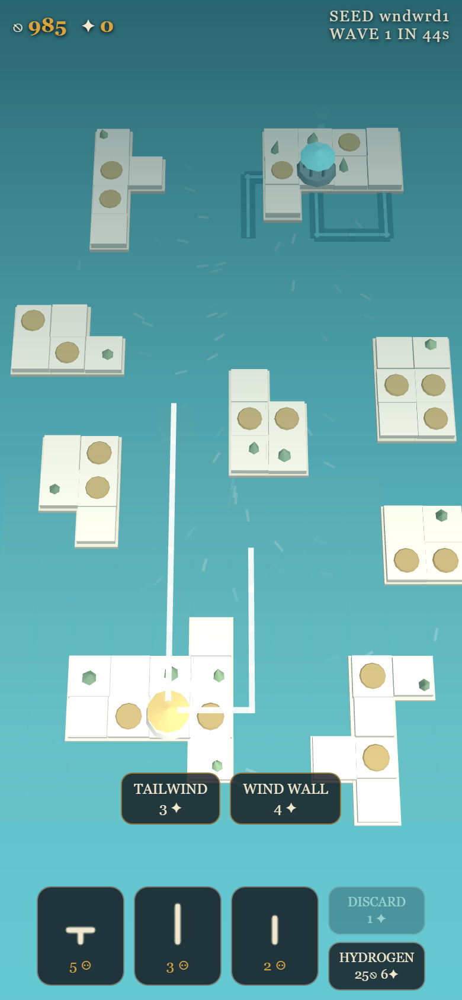
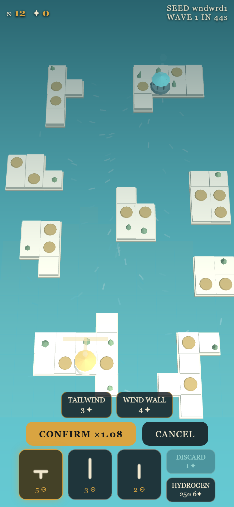
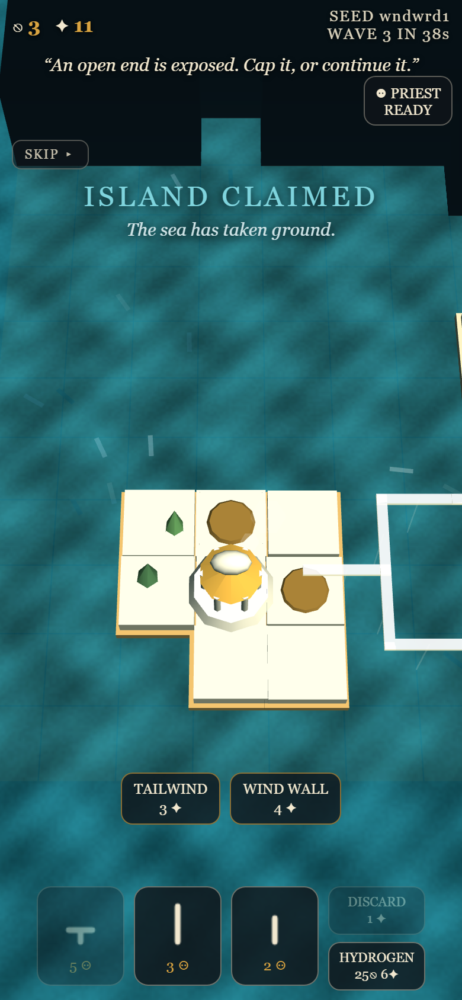
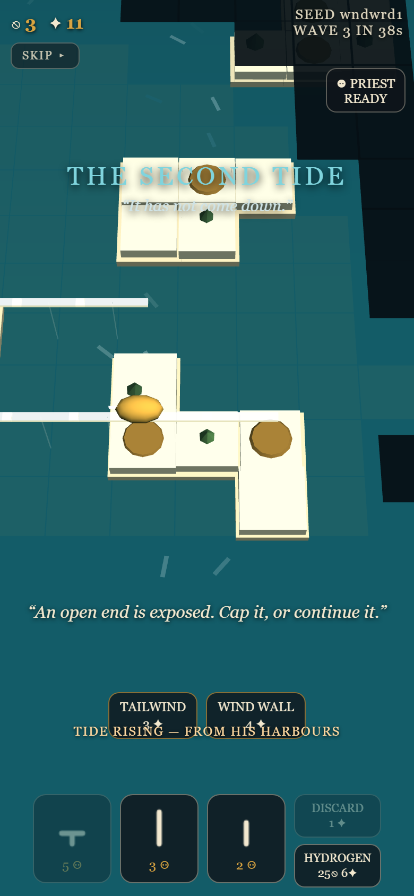
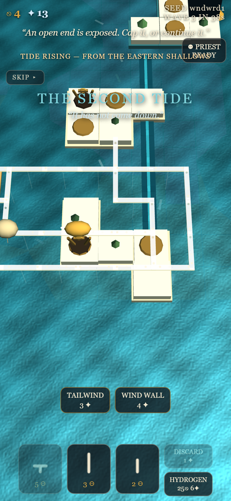
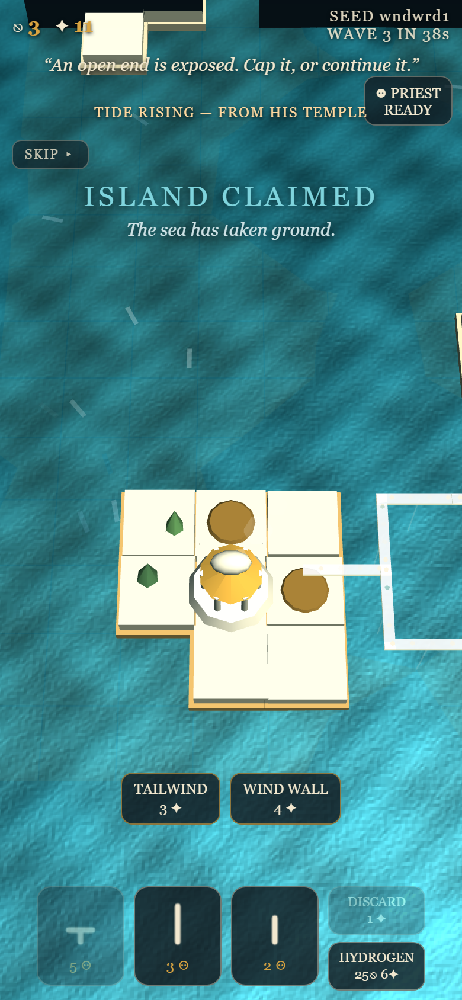
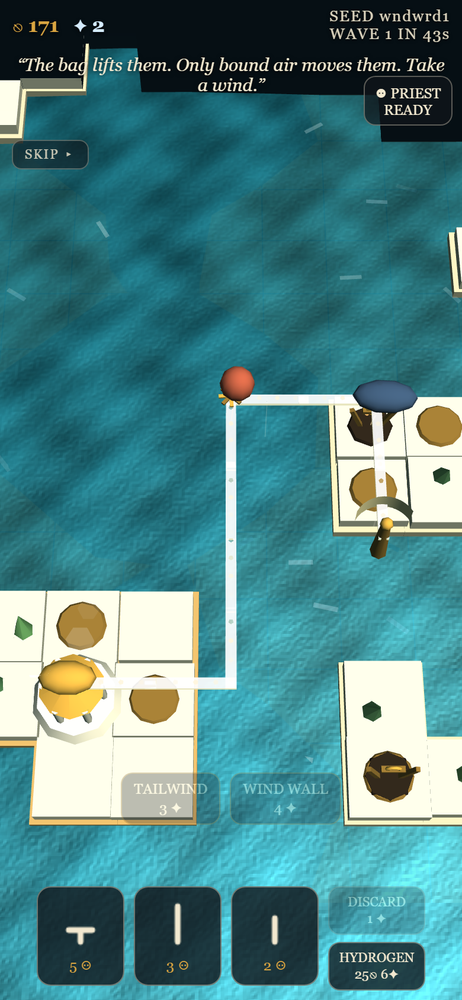

# WINDWARD — Archipelago of the Gods

A portrait mobile web prototype for the Meta Horizon Creator Competition (Tower Defense & Strategy).

**▶ Play the current build: https://jamesdavid.github.io/Windward/** (open on a phone, or a narrow browser window)

> You are the high priest of Aeolus. Build circuits of bound wind into a working logistics network across a Greek archipelago, cap its exposed ends with defenses, survive nine escalating waves from Poseidon's priesthood, watch severed infrastructure physically unravel — and race to reconnect it before the collapse reaches something you love.

**Tech:** Three.js / HTML5, single-player, portrait, fully offline. All entrant-authored code assembles into one readable `index.html`; Three.js lives under `/vendor`. All art is procedural Three.js geometry and all audio is runtime WebAudio synthesis — no external assets of any kind.

---

## Playing

Open `index.html` in a browser (portrait phone, or a narrow browser window). No server or network needed.

- **Tap a route piece** from your hand of three, tap a glowing socket, tap the preview to rotate, confirm.
- **Tap a network endpoint or island plot** to build a gun, shield, shipyard, or Temple.
- **Tap an island** to send your priest there; he must stand on an island for the 10 s a Temple takes to consecrate.
- Win by felling Poseidon's Great Temple. Lose if he fells yours. One-tap reset.

## Development

```
node build.js      # assemble src/*.js into index.html
node test/test_mapgen.js   # headless logic tests
```

Game logic lives in `src/*.js` (concatenated in filename order); every tunable number lives in the frozen `CONFIG` object at the top of the built file. `buildlog/BUILDLOG.md` is the running build log required by the competition.

---

## Feature log

Screenshots are portrait-phone captures (390×844) added as each feature lands.

### 1. Deterministic archipelago generation *(done)*

Every match generates its own nine-island archipelago from a seed shown on the start screen — type a seed back in to replay a map exactly. Generation is zone-constrained (corner opposition never varies, island positions and reserves do) and validated against 11 invariants: supply islands inside starting influence, 8–12 cell runs to the contested interior, a guaranteed over-water approach for Wave 5's scripted strike, a priced island-hop alternative, an open channel so Poseidon's lanes can always be reached, wind that rewards circuit routes over out-and-back spurs, and more. Failed seeds re-roll; a verified golden seed is the last-resort fallback.

 

### 2. Portrait scene and the two layers *(done)*

Fixed oblique camera, no rotation. Limestone islands with bronze building plots, temple colonnades at the two Great Temples, and the wind made visible everywhere it matters: whitecaps drift along the wind vector, trees lean into it, temple smoke streams downwind. Aeolus' corridors are elevated luminous ivory ribbons; Poseidon's lanes are broad dark bands lying on the water — instantly distinguishable layers on a phone.



### 3. Route piece placement *(done)*

A hand of three pieces (short/long straights, L-turn, S-bend, T-junction). Tap a piece, legal sockets illuminate; tap a socket, the piece previews; tap the preview to cycle orientations; confirm. No dragging anywhere. The confirm button shows the wind speed multiplier the new corridor would ride (×0.70–×1.35) before you commit — the placement ghost is a wind instrument. Influence gates every placement, and a rival's claimed islands refuse connection. Behind it sits the support graph: every segment traces to an anchor, severed branches fray for a 3-second rescue window and then visibly unbind segment by segment from the break inward; reconnecting relights everything instantly.



### 4. A scrolling world under an exploration shroud *(done)*

The map is deliberately larger than the screen — sized in portrait-screen tiles from a single CONFIG entry (default 2×3 screens; island count scales automatically, with small stepping-stone islands grown wherever the island-hop chain would stretch beyond hop range). Drag to pan; the fixed oblique angle never rotates. Unexplored terrain sits under a dark shroud that lifts permanently as your reach — structures, corridors, ships — extends across the archipelago. Enemy craft additionally require live vision; enemy structures and lanes, once seen, stay drawn at their last known state.

 

### 5. Living logistics *(done)*

Islands mine into local stockpiles; haulers bought at yards ride your corridors, dwell to load, and only credit cargo when they moor at the Great Temple. Islands deplete and force expansion. Cut the road beneath a ship and it goes **adrift** — tumbling downwind on the visible wind field, bleeding hull, until it touches a supported friendly segment (cargo intact) or dies (cargo lost, wreck marker). The priest rides the same rules: consecrating a Temple takes ten seconds of his presence, claiming the island, crumbling every rival connection to it — and if he's killed, a successor takes 25 seconds to invest at home.

### 6. War on the road itself *(done)*

Nine authored waves, each telegraphed eight seconds out with Poseidon's own words, each launched from his temple nearest your forward holdings — take his ground and his tide must come further. **Paths are invulnerable along their length**: what can be attacked are raw open ends (uncapped tips), and structures. Cap a tip with a gun and the path behind it is safe — until the gun dies, explodes its adjacent segment, and re-opens the end. Networks erode from their tips; inline structures (routes continued through a tower's ports) are the high-stakes joints whose destruction severs everything beyond and starts the visible segment-by-segment unbinding. Siphons can only reach ends over open water; your ballast jars can't touch lanes hugging a coast. Wave 5 is a scripted heavy strike on your most forward structure (verified end-to-end by an automated test); wave 6 brings Tidal Surge — the one power that can bite mid-corridor — wave 7 Fog Bank, wave 8 the Age of Wrath. Poseidon builds his own lanes piece by visible piece, founds temples with his own priest, raises siphon masts along contested straits, and reroutes (after a cooldown) when you cut him.

### 7. Reading the fight *(done)*

Combat is drawn: gold ballast tracers falling from your guns, teal jets rising from his, impact sparks, explosion rings, wreck markers. Great Temples carry floating health bars (his obeys fog memory), and the screen edge glows red while your temple is under fire. Island bases tint with allegiance — gold yours, teal his, pale stone neutral. Tapping anything names it, with hit points, ore remaining, and allegiance.

### 8. Reach is everything *(done — player-directed rules)*

Three rules landed from live playtesting. **Roads are reach**: route pieces and the towers on their endpoints aren't influence-gated — drive a corridor into Poseidon's waters to lift the fog and put guns on his infrastructure. **Paths are invulnerable along their length**: only raw open ends and structures can be attacked, so towers are the joints of the network and losing one blows the road open. **His craft need his lanes**: Poseidon's ships operate only in waters his network reaches — he must build toward you to strike you, and cutting his lanes physically pushes his reach back. Ore islands carry visible quarries with headframes; loaded haulers sling a gold ore crate; the sea is bump-lit and swells with the wind.

 

### 9. An army you can read *(done — player-directed)*

Poseidon's assault craft are **lane-bound**: they ride his network like his haulers, halt on the lane within weapon range, and fire from there — cut the lane beneath them and they tumble adrift. Every structure type has its own silhouette (rust vane drum with spinning arms, long navy zeppelin battery, grounded bronze shield pylon, marble temple, timber yard); wounded structures burn and smoke; kills fling embers; every shot has a muzzle flare, a tracer, and a sound. Build menus explain what each unit does in a line.



