# WINDWARD — The Age of Air

A portrait mobile web prototype for the Meta Horizon Creator Competition (Tower Defense & Strategy).

**▶ Play the current build: https://jamesdavid.github.io/Windward/** (open on a phone, or a narrow browser window)

> **One road, five jobs.** A single system carries the whole game — the bound road. It is *movement* (everything rides it), *income* (islands it touches are mined; haulers must land the ore), *reach* (only the road lifts the fog and grants ground), *attack surface* (roads are invulnerable along their length — the raw ends and capping towers are the joints), and *drama* (a severed branch visibly unbinds segment by segment while you race to reconnect it). The hard constraint is the clock: **the tide comes nine times**, each further and harder — and the ninth only says *come down*. Play either god: bind the air, or ride the waves.

**Tech:** Three.js / HTML5, single-player, portrait, fully offline. All entrant-authored code assembles into one readable `index.html`; Three.js lives under `/vendor`. All art is procedural Three.js geometry and all audio is runtime WebAudio synthesis — no external assets of any kind.

---

## Watch the game beat Poseidon

A full match played by the **genetically-evolved champion strategy** (the same one that drives WATCH A MATCH mode), filmed on the reference seed and shown at speed: temple chains toward Poseidon's corner, aimed bolt batteries at his doorstep, Wind Walls at every telegraph, the hydrogen refit — then nine tides and his wrath weathered with the temple standing, and the verdict: **ZEUS RULES IN YOUR FAVOR**, with REFUSE — FIGHT ON offered on screen:

**▶ [Watch the full match (mp4, ~1.75 min)](docs/media/match_timelapse.mp4)**

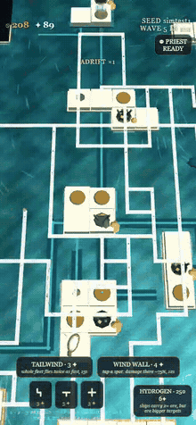

---

## Playing

Open `index.html` in a browser (portrait phone, or a narrow browser window). No server or network needed.

- **Tap anywhere gold markers glow** — island coasts, route ends, structure ports. A context menu opens at your thumb, its options grouped in labelled category columns (ATTACK · SHIELD · FACTORY · RITES · FAVOR · DESTROY, with PATHWAYS on the row nearest your thumb, and a ✕ to dismiss): the route pieces in your hand that fit there, every building valid at that spot (each explained in a line), the divine powers (Tailwind anywhere; the Wall shelters the very spot you tapped), salvage, and a Favor-priced reroll. A ghost's wind readout tells you what you're binding — TAILWIND, FAIR WIND, or HEADWIND — before you CONFIRM. The bottom bar is empty by design — the whole screen belongs to the map. And you can leave anytime: the match saves itself when the page loses focus and offers RESUME on your return.
- **Route pieces cost Favor (✦), flat rate**; buildings and haulers cost Supply (⚇), hauled home as ore.
- **Tap the ghost to turn it, CONFIRM to bind.** The confirm button quotes the wind multiplier the new corridor would ride.
- **Tap an island** to send your priest; ten seconds of his presence consecrates a Temple and claims the island.
- **Any island your supported network touches mines automatically** — claiming it *secures* the ore against Poseidon's counter-claim.
- Win by felling Poseidon's Great Temple. Lose if he fells yours. One-tap reset.
- **Touch:** drag pans, pinch zooms, two fingers rotate, three-finger vertical swipe tilts. **Mouse:** click and drag as above, wheel zooms, right-drag orbits and tilts.

## Development

```
node build.js              # assemble src/*.js into index.html
node test/test_mapgen.js   # headless logic tests (also: network, sim, win, wave5, gauntlet, fairplay)
node test/opt_capacity.js  # balance sweep harnesses (favor price, income, hauler capacity)
```

Game logic lives in `src/*.js` (concatenated in filename order); every tunable number lives in the frozen `CONFIG` object at the top of the built file. `buildlog/BUILDLOG.md` is the running build log required by the competition.

---

## Feature log

Screenshots are portrait-phone captures (390×844) retaken as the game evolves; this slate is current as of the sweep-tuned build.

### 1. Deterministic archipelago generation *(done)*

Every match generates its own archipelago from a seed shown on the start screen — type a seed back in to replay a map exactly. Generation is zone-constrained (corner opposition never varies, island positions and reserves do) and validated against 12 invariants: supply islands inside starting influence, measured runs to the contested interior, a guaranteed over-water approach for Wave 5's scripted strike, a priced island-hop alternative, an open channel so Poseidon's lanes can always be reached, wind that rewards circuit routes over out-and-back spurs, and a proven win path. Failed seeds re-roll; a verified golden seed is the last-resort fallback.

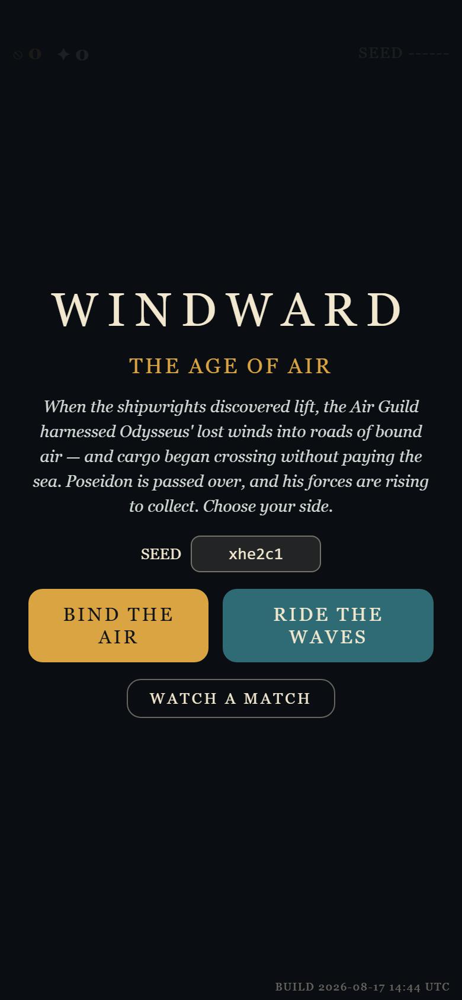 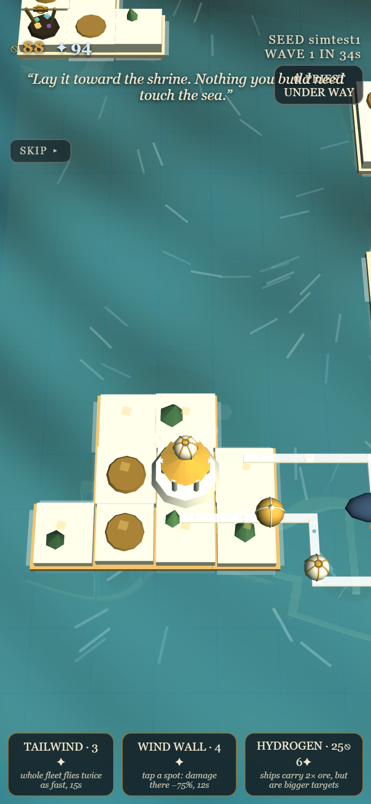

### 2. A scrolling world under an exploration shroud *(done)*

The map is deliberately larger than the screen — sized in portrait-screen tiles from a single CONFIG entry (currently 3×3 screens; island count scales automatically, with small stepping-stone skerries grown wherever the island-hop chain would stretch beyond hop range). Drag to pan, pinch to zoom, two fingers to rotate; the oblique tilt never changes. Unexplored terrain sits under an opaque shroud that lifts permanently as your reach extends. Enemy craft additionally require live vision; enemy structures and lanes, once seen, stay drawn at their last known state — and a live lane ghosts one segment beyond your vision, so his paths visibly continue somewhere rather than materialising parentless at the fog edge.

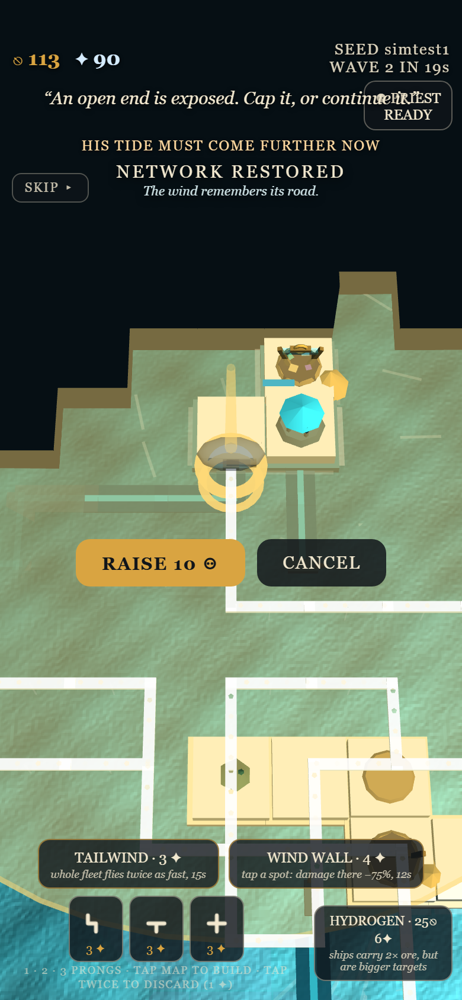

### 3. Build where you're looking *(done — player-directed)*

The interaction is location-first: gold markers glow on every spot you can act, taps snap generously at this perspective, and a context menu opens **at your thumb** — your balance on top, buildings with one-line explanations in the middle, route-piece chips and a reroll on the bottom row nearest your thumb. The hand always holds three prong classes (1 / 2 / 3+); rerolling and discarding are Favor-priced. Confirm/turn/cancel float beside the placement ghost, and arming a weapon lights every legal site with the range ring drawn before you pay.

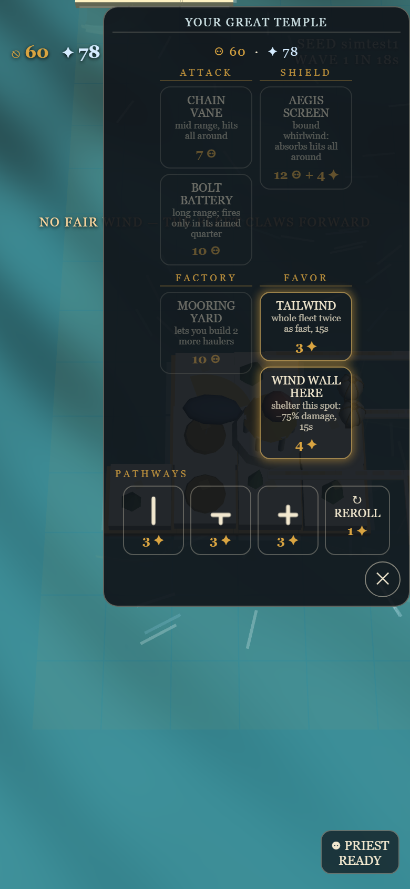 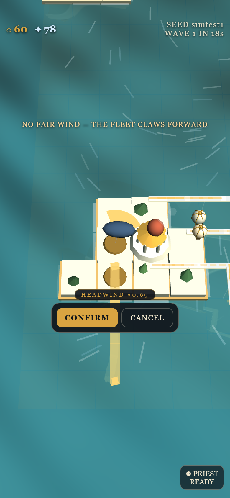

### 4. Living logistics *(done)*

Islands carry 500–1500 ore in visible quarries — headframes, pits, and gems that twinkle while reserves last. Any island your supported network touches mines into its local stockpile; haulers bought at yards ride your corridors, dwell to load, and only credit cargo when they moor at the Great Temple (with a satisfying ching). Hauler capacity is sweep-tuned at 12 (24 hydrogen). Cut the road beneath a ship and it goes **adrift** — tumbling downwind on the visible wind field, bleeding hull, until it touches a supported friendly segment or dies. The priest rides the same rules; if he's killed, a successor takes 25 seconds to invest at home.

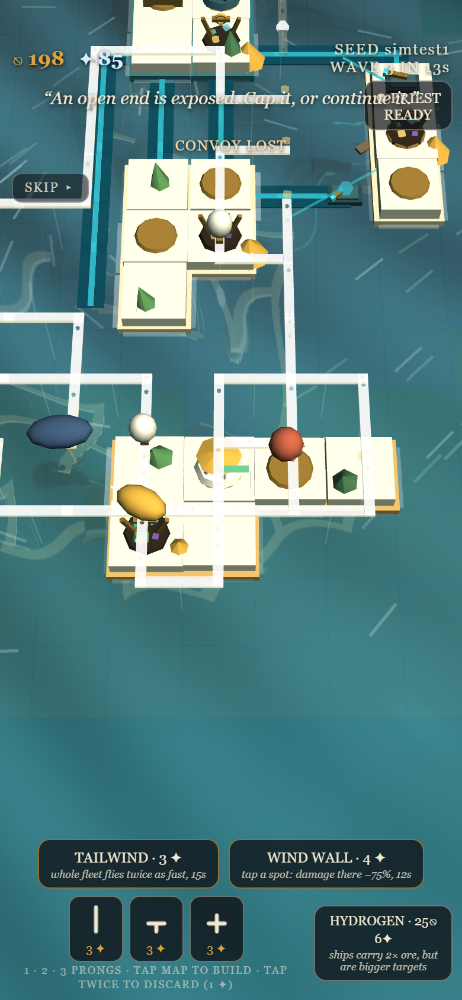

### 5. War on the road itself *(done)*

Nine authored waves, each telegraphed with Poseidon's own words, each launched from his temple nearest your forward holdings — take his ground and his tide must come further. **Paths are invulnerable along their length**: what can be attacked are raw open ends and structures. Cap a tip with a gun and the path behind it is safe — until the gun dies, explodes its adjacent segment, and re-opens the end. Networks erode from their tips; severed branches fray for a 3-second rescue window and then visibly unbind segment by segment from the break inward; reconnecting relights everything instantly. Wave 5 is a scripted heavy strike verified end-to-end by an automated test; later waves bring Tidal Surge, Fog Bank, and the Age of Wrath.

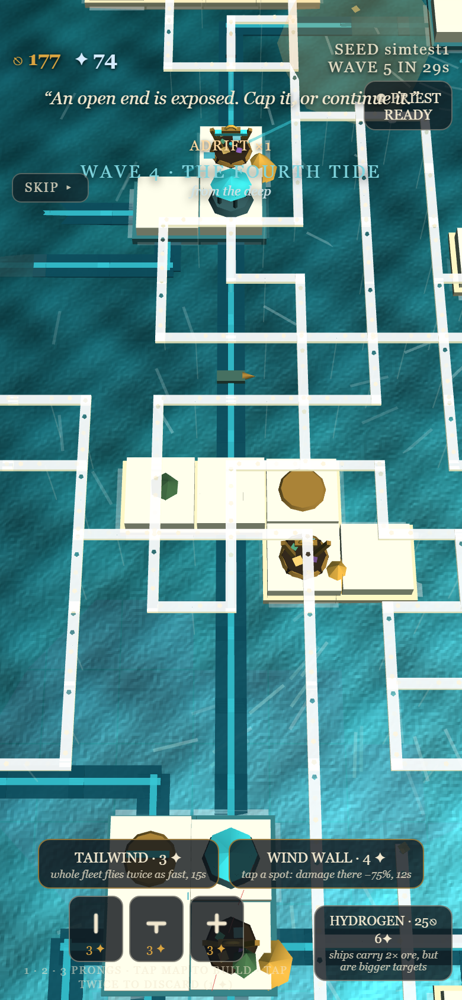

### 6. An enemy that plays by your rules *(done — player-directed)*

Poseidon builds his own lanes piece by visible piece from sockets of his own network, founds temples with his own priest, and reroutes when you cut him. His assault craft are **lane-bound**: they ride his network, halt within weapon range, and fire from there — cut the lane beneath them and they tumble adrift. `test/test_fairplay.js` independently re-walks his lane graph from his Great Temple every two sim-seconds across three full matches: every lane he ever lays traces home, and every cut lane dies on a collapse timer. Tap any lane to have it named — his say so out loud: *TRACES HOME TO HIS TEMPLES*.

### 7. Reach is everything *(done — player-directed rules)*

**Roads are reach**: route pieces and the towers on their endpoints aren't influence-gated — drive a corridor into Poseidon's waters to lift the fog and put guns on his infrastructure. **His craft need his lanes**: he must build toward you to strike you, and cutting his lanes physically pushes his reach back. Every structure type has its own silhouette (rust vane drum, navy zeppelin battery, bronze shield pylon, marble temple, timber yard); wounded structures burn; kills fling embers; every shot has a flare, a tracer, and a synthesized report. The sea is bump-lit, swells with the wind, and foams along coasts.

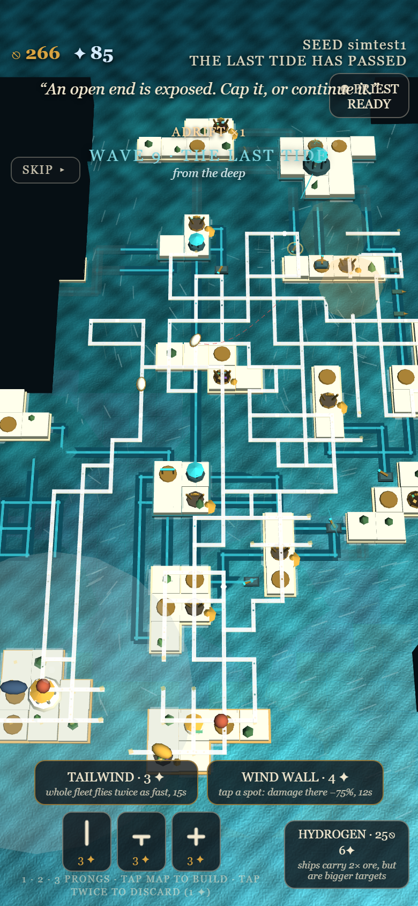

### 8. Salvage, bounty, and solid defenses *(done — player-directed, NetStorm-inspired)*

Nothing is forever-spent: **salvage** any of your structures for half its cost back, or unbind route segments tip-first for a Favor each — no explosion, but the support graph recalculates, so reclaiming a load-bearing tower frays everything beyond it. **Death pays**: a downed enemy craft grants Favor by class (adrift losses count — cutting the lane under a ship *is* a kill), and combat-killed structures pay a quarter of their cost. And **defenses are solid**: guns, screens, and masts accept no onward path, and standing on a route they block transit for everyone — including your own ships, which slip loose and drift if a new tower seals the road under them. Towers cap; temples junction; plan accordingly.

### 9. The airfield *(done — player-directed)*

The Mooring Yard is a working airfield: an open hangar, a mooring mast with a fluttering pennant, and **fleet-status dots** above the roof — one per mooring the fleet cap allows, lit while a hauler holds it. Tapping a yard opens its own dialog: build a hauler (with the moored count in the button), upgrade the whole fleet from hot air to hydrogen, or salvage the yard. Hot-air haulers are now true **free balloons** — round envelope, wicker basket slung on cables — and their burners flare on each ship's own rhythm, lighting the envelope from within as fire heats the air.

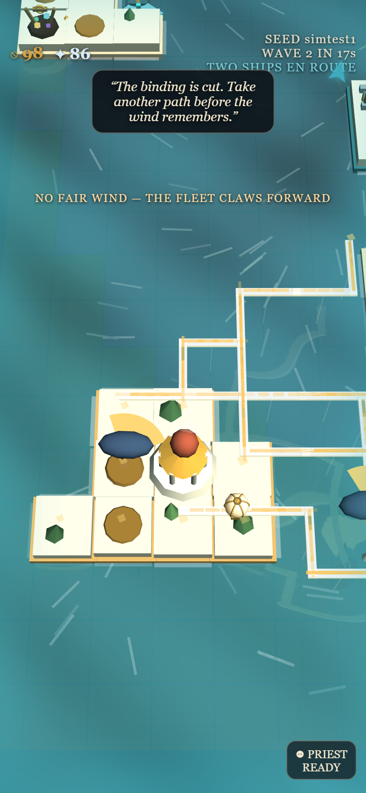 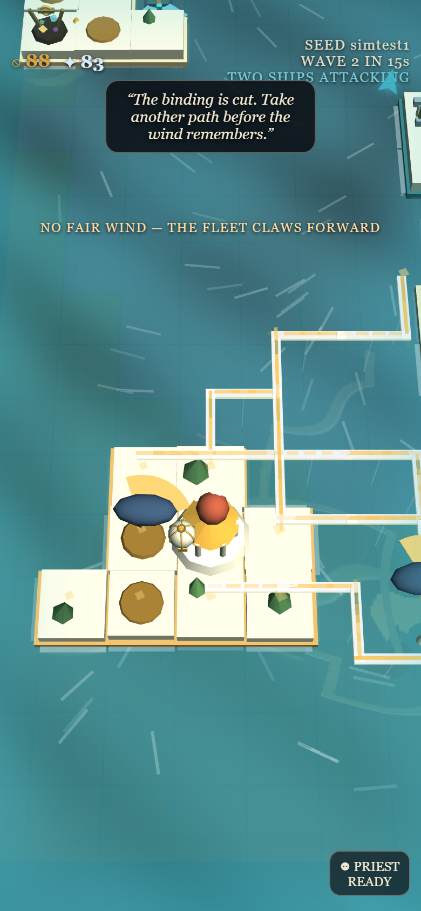

### 10. A world with weather *(done — player-directed)*

Cinema that never takes the controls: low stylized clouds drift on the wind field, dragging soft shadows across the sea; Poseidon's surf rises and bursts white against the rim of the arena on all four sides; the camera takes one slow breath outward while a wave is telegraphed (your pinch always wins — it's a multiplier, not a zoom change); coins burst where bounties are earned and where cargo is credited; and the endgame is honest siegecraft — a wider, longer Wind Wall shelters a raising gun, and directional guns silence armed defenders before battering temples, verified end-to-end by `test/test_siege.js` against his defended Great Temple.

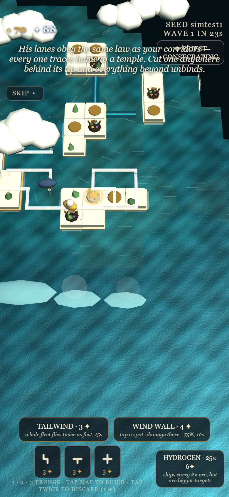

### 11. Choose your god *(done — player-directed)*

Two calls to action: **BIND THE AIR** or **RIDE THE WAVES**. Playing Poseidon mirrors the entire presentation — your network becomes sea-lanes lying dark on the water, your fleet becomes triremes, your temples wear the teal, and the enemy becomes the Air Guild with ivory sky-roads and balloons — while the underlying, sweep-tuned match stays identical, so both sides play a game that is proven fair. A five-line first-play tutorial teaches the loop (pathways, mining and haulers, temples and Favor, coin for arms, Favor for divine aid) once ever, with SKIP TUTORIAL for returners.

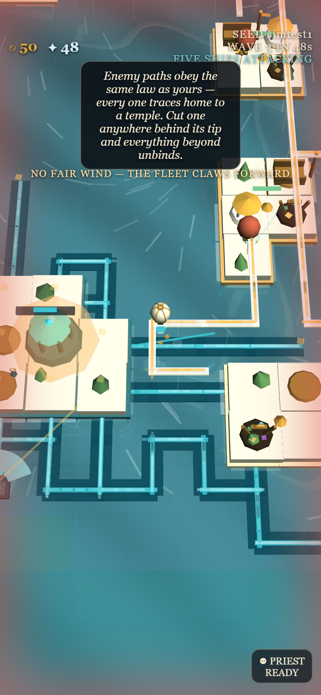

### 12. Tuned by simulation *(done)*

Ten parameter-sweep harnesses (`test/opt_*.js`) run scripted full matches across seeds and score match quality — arc length, pressure survived, engagement, economies alive, no degenerate spam. The trial player exercises the whole game: it plays branchers and hubs (the wind law rewards loops), casts Wind Wall at telegraphs and Tailwind on loaded convoys, and buys the hydrogen refit. Every tunable in the config now carries either a sweep citation or a player-directive note: piece prices, temple income, hauler capacity/cost/dwell, difficulty ramp and gun-vs-road damage, starting currency (100/100 turned out to be the exact 16-cell grid optimum — richer starts plateau *lower*), kill bounties (×2 rescues comeback rebuilding), the wind-law fractions, mining rate, and the AI's decision cadence (sharply peaked at 2s). Sweeps that would have scored noise — salvage refunds, and power prices beyond "5✦+ tailwind is uniformly worse" — are honestly marked judgment-tuned.

### 13. A demonstrator that plays the real UI — and wins *(done — player-directed, genetically evolved)*

**WATCH A MATCH** hands the controls to a demonstrator that plays exactly the way you would: it opens the true context menu at the spot it's acting on, the button it means to press lights gold and pulses, and ghost placements walk the same TURN → CONFIRM flow — priest voyages, temples, guns aimed with visible TURN presses, shields, both divine powers, the hydrogen refit through the yard dialog. And it is *good*: its strategy is the champion of a **genetic search** (14 genes, 14 generations × 18 genomes, ~800 headless matches against the real Poseidon AI) that wins all six holdout seeds. The doctrine evolution discovered is a blitz — offense from the first minute, relentless kill-shot spacing, a fat gun reserve, a lean fleet, and almost no static defense, because tempo *is* defense. Live, through the menus, it wins the reference seed by assault in ~3 minutes; on maps whose corner it can't crack, it consolidates and takes Zeus's verdict instead. The wave chip narrates the assault ("TWO SHIPS EN ROUTE" → "ATTACKING"), and any tap returns you to the title. The whole harness ships in `test/` (`ga_lib.js`, `opt_evolve.js`) and re-runs with one command after any balance change.

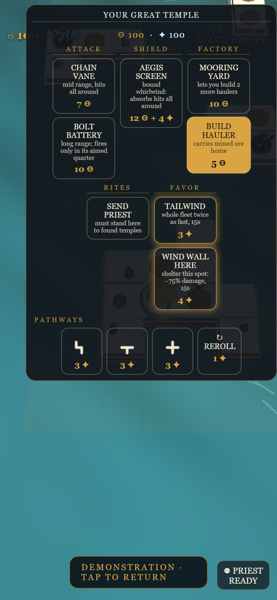

### 14. The wind rules the roads *(done — player-directed, three rulings)*

Haulers route on the best channel the wind favors and never travel opposite the air in a channel — but "we have the air god on our side": a side's own bound channels carry a held current (effective speed floored at the binding, ~0.91× for air, ~0.98× for Poseidon's dredged lanes), so your roads always work, while route planning weighs the *raw* prevailing wind so naturally favorable channels win. The emergent payoff: **build a loop and the airflow becomes a loop** — the fleet rides out along the with-wind arc and home along the other. Raw wind rules anything unbound; if no favorable channel exists at all, a fleet holds at its mooring for the shift, then tacks under a heavy penalty rather than deadlock. The hydrogen refit (bow scoops, powered lift) is exempt, a genuine second reason to buy it. Headless proof drove the design: a strict no-adverse-legs rule starved the reference seed for an entire match — the bound-channel floor restored the economy (63 deliveries) with routing still visibly wind-shaped. **And the flow is visible**: gold streaks ride every air ribbon and foam-cyan dashes ride every sea lane, always in the wind's true direction — long and quick where the wind agrees, short stubs where the god holds the current — so you can read which way a channel wants your fleet to travel at a glance (remembered enemy lanes under fog show no live flow; that would leak the wind). Waits are legible too: the ticker says "THE WIND SETS AGAINST THE ROAD — THE FLEET WAITS" (or "NO FAIR WIND — THE FLEET CLAWS FORWARD" when tacking), and tapping a hauler shows its state. The difficulty grid was re-swept under the wind-law economy (`gun-vs-road 0.45`, same ramp).

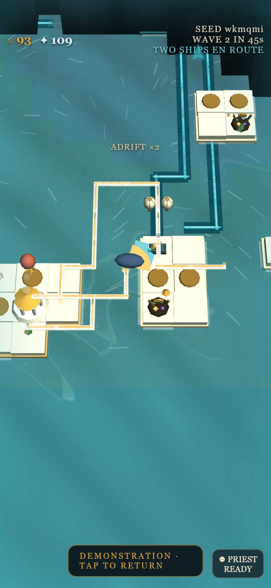 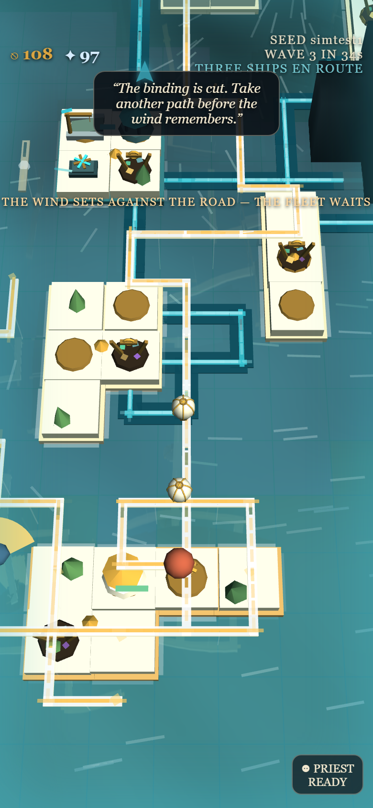

### 15. Every match ends *(done — funness audit)*

An 8-seed census caught half of all matches fizzling: the ninth tide passes, nothing forces a conclusion, and a full-health player just drifts. Now the tide never stops — past the authored nine, **wrath tides** come every 30 seconds at the final horde composition, escalating (+0.15 strength per tide toward a 1.8 cap) until something breaks. And for the fortress player nothing can break (census seeds survived 25 waves untouched), there is a verdict instead of a void: weather nine tides *and* five full wrath tides with your Great Temple standing, and **ZEUS RULES IN YOUR FAVOR** — plainly worded as the victory it is. Prefer the kill? A gold **REFUSE — FIGHT ON** button declines the verdict: the tides resume permanently, and only a fallen Great Temple ends the matter. Re-census after the change: 0/8 timeouts; every match ends with a screen, never a shrug.

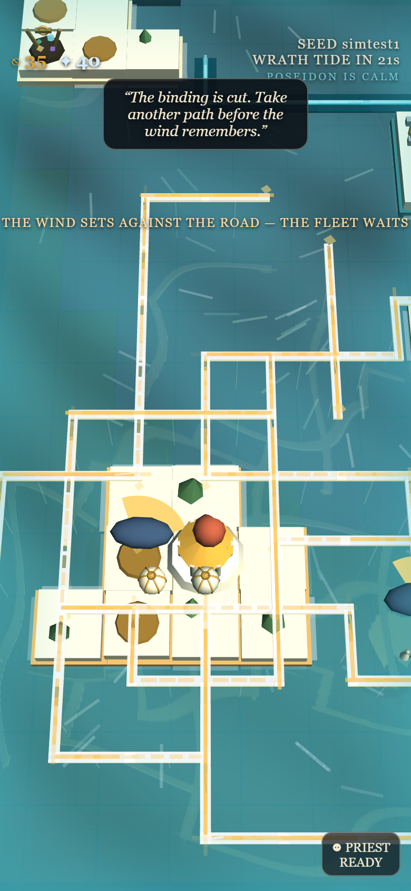 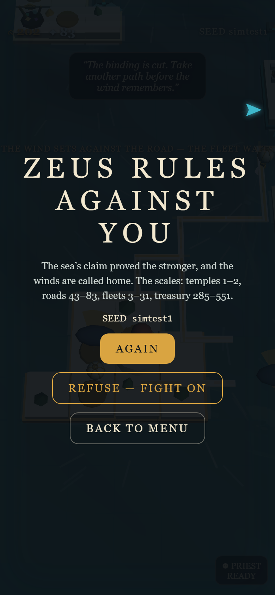

### 16. Life happens — save & resume *(done — player-directed: "this is a mobile game")*

Lock your phone, switch apps, lose the tab mid-siege: the moment the page loses focus, the full match state snapshots to local storage — resources, every road with its support state, structures, haulers mid-flight with cargo and paths, priests, enemy craft, the wave clock, fog exploration, quarry reserves. The map itself regenerates from the seed. On your next visit the title screen offers **RESUME YOUR MATCH — WAVE N · seed**; restoring re-links everything and recalculates support, influence, and fog. Demo matches never save; a decided match clears its save. The whole round trip is a permanent Playwright test in the battery (`test/test_resume.js`): save on hide, offer on reload, exact restore, resumed match proven alive. A build stamp on the title corner settles which-version-am-I-running questions at a glance.

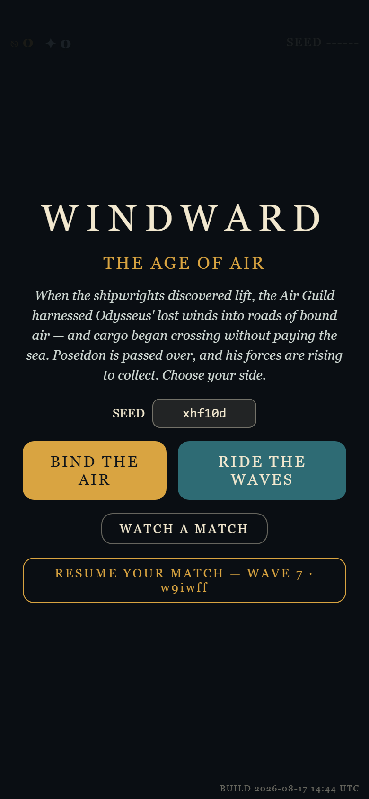

